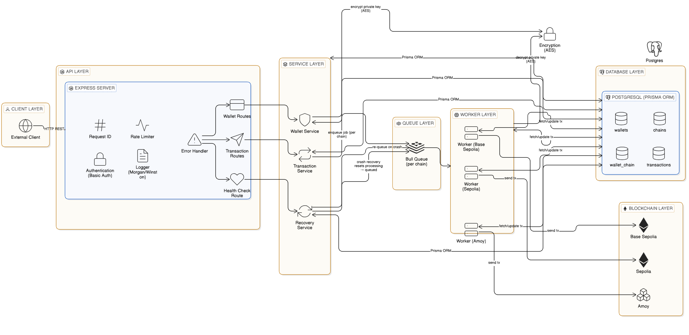
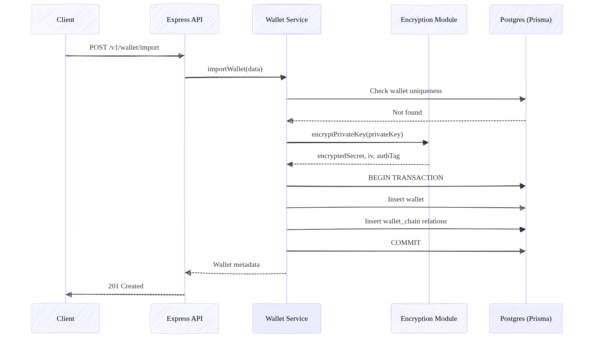
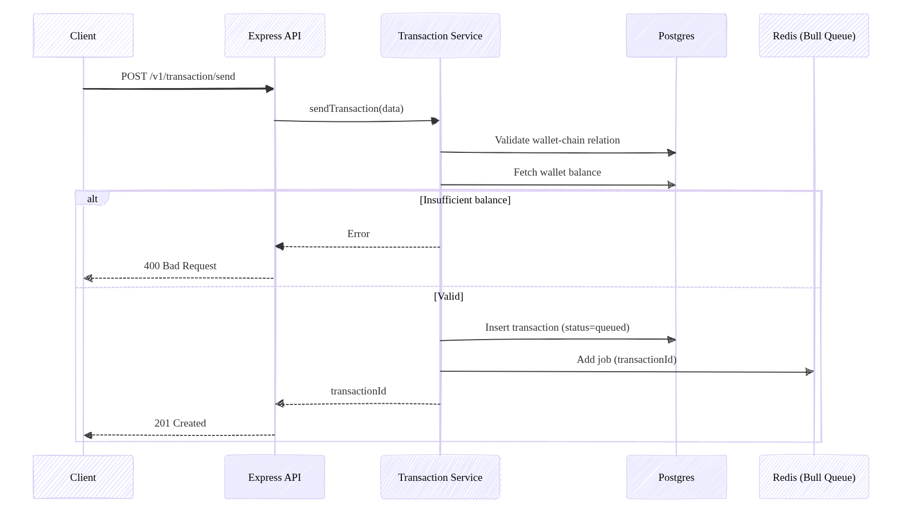
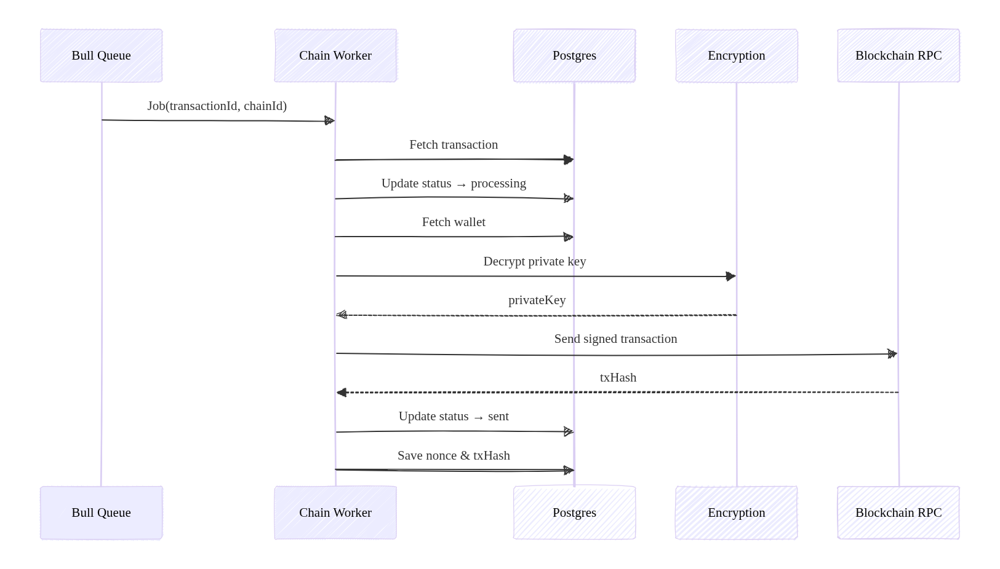

# Chainflow V1 Documentation


## Project Overview

Chainflow V1 is a robustness-oriented Web3 backend infrastructure designed to prioritize correctness, reliability, and maintainability over scalability in its initial iteration. At its core, the system serves as a secure and deterministic platform for managing encrypted wallets and processing asynchronous blockchain transactions across multiple chains. This approach ensures that all operations are executed in a predictable manner, minimizing risks associated with state inconsistencies or unexpected behaviors.

**Key functionalities include:**

* **Encrypted Wallet Management**: Securely stores and handles wallets, with support for associating wallets to specific blockchain chains.
* **Per-Chain Wallet Enablement**: Allows wallets to be enabled on a per-chain basis, providing flexibility for multi-chain operations.
* **Asynchronous Transaction Handling**: Accepts transaction requests, queues them for execution, and manages their lifecycle without blocking the client.
* **Per-Chain Queuing**: Utilizes dedicated queues for each blockchain chain to isolate and organize transaction processing.
* **Transaction Lifecycle Management**: Tracks the state of transactions from initiation to completion or failure, ensuring transparency and auditability.
* **Automatic Retry with Failure Classification**: Retries transient failures (RPC errors, timeouts) up to 3 times with exponential backoff. Permanent failures (insufficient funds, nonce conflicts) are classified and marked immediately without retrying.
* **Confirmation Polling**: After broadcast, a status worker polls the chain for transaction receipts and transitions the transaction to `mined` (confirmed) or `failed` (reverted).
* **In-Memory Caching**: Frequently accessed data (chain configs, wallet-chain associations) is cached in memory to reduce database load and speed up validation.
* **Crash Recovery Mechanisms**: Implements safeguards to recover gracefully from system crashes, preserving data integrity.
* **Docker Support**: Fully containerized with Docker Compose for zero-config local deployment.

**Priorities in V1 emphasize:**

* **Deterministic Behavior**: All processes are designed to produce consistent outcomes given the same inputs, reducing non-determinism in blockchain interactions.
* **State Correctness**: Rigorous validation and state transitions ensure that the system's internal state accurately reflects reality.
* **Clean Layering**: The architecture is modular, with clear separation of concerns to facilitate maintenance and debugging.
* **Observability**: Extensive logging and structured responses enable easy monitoring and troubleshooting.
* **Infrastructure Clarity**: Uses well-established tools like Postgres and Redis with configurations focused on durability and simplicity.

**Scalability features such as parallel processing, horizontal worker scaling, and advanced nonce management are intentionally deferred to future versions to maintain focus on foundational reliability.**


## Architecture Overview



The system follows a layered architecture to promote separation of concerns and ease of development. Requests flow sequentially through the layers, ensuring that each component handles a specific aspect of the operation. This design prevents tight coupling and allows for independent testing and scaling of individual layers.

**High-level flow:**

* **Client** → Initiates requests via HTTP.
* **Express API Layer** → Handles incoming requests, validation, and response formatting.
* **Cache Layer (In-Memory)** → Serves cached chain and wallet-chain data to avoid redundant DB reads.
* **Service Layer** → Encapsulates business logic, including validations and transaction preparation.
* **Database (Postgres via Prisma)** → Persists data using an ORM for type-safe interactions.
* **Queue Layer (Bull + Redis)** → Manages job queuing with durability features.
* **Worker Layer** → Executes queued jobs, interacting with blockchain RPCs.
* **Status Worker Layer** → Polls the blockchain for transaction receipts and updates transaction state.
* **Blockchain RPC** → External interface for signing and broadcasting transactions.

This unidirectional flow ensures that errors are propagated appropriately and that the system remains resilient to failures at any layer.


## Sequence Diagrams

### 1. Import Wallet



### 2. Transaction Submission Flow (API → Queue)



### 3. Worker Processing Flow




## Layers Breakdown

### 1. API Layer

The API layer serves as the entry point for all client interactions, built on Express.js for efficient request handling. It focuses on ensuring that requests are properly validated and logged before passing control to deeper layers.

**Responsibilities:**

* **Request Validation**: Checks for the presence and format of required parameters to prevent invalid data from propagating.
* **Authentication**: All routes require HTTP Basic Auth credentials.
* **Rate Limiting**: Per-IP throttling to prevent abuse.
* **Request ID Injection**: Each request receives a unique ID that is logged throughout its lifecycle.
* **Lifecycle Logging**: Records the start, processing, and end of each request for auditing and performance monitoring.
* **Service Invocation**: Calls the appropriate service method to perform the core operation.
* **Structured Responses**: Returns JSON responses in a consistent format (`{ success: true, result: { ... } }`), including success data or error details.
* **Error Propagation**: Forwards any exceptions to a centralized error-handling middleware, which standardizes error responses (e.g., HTTP status codes and messages).

This layer acts as a gatekeeper, enhancing security and usability by providing clear, predictable interfaces.

### 2. Cache Layer

The cache layer is a lightweight in-memory store (Node.js `Map`) that sits between the API/validation layer and the database. It reduces redundant reads for frequently accessed, rarely changing data.

**What is cached:**

* **Chain configs** (`chains:<chainId>`, `chains:all`): Cached for 1 hour (TTL: 3,600,000 ms). Used by the validation middleware (chain ID validation), queue manager (queue initialization), and workers (RPC URL lookup).
* **Wallet-chain associations** (`walletChain:<walletId>:<chainId>`, `walletChains:<walletId>`): Cached for 30 minutes (TTL: 1,800,000 ms). Used to verify that a wallet is enabled for a given chain before enqueuing a transaction.

**Design:**

* Singleton service — one shared cache instance across the process.
* TTL-based auto-expiry using `setTimeout`.
* Falls back to the database on a cache miss and repopulates automatically.
* Does not use Redis — kept strictly separate from the queue layer.

### 3. Service Layer

The service layer houses the application's business logic, bridging the API and persistence layers. It ensures that operations align with domain rules, such as wallet permissions and balance sufficiency.

**Responsibilities:**

* **Business Logic Execution**: Orchestrates the steps needed for operations like wallet imports or transaction submissions.
* **Wallet-Chain Validation**: Verifies that the requested wallet is enabled for the specified chain, preventing unauthorized actions.
* **Balance Checks**: Queries the blockchain (via RPC) to confirm sufficient funds before proceeding, avoiding failed transactions due to insufficient balance.
* **Transaction Construction**: Builds the transaction payload, including calldata for contract interactions if applicable.
* **Database Writes**: Inserts initial transaction records into the database with a `queued` status.
* **Job Enqueuing**: Adds the job to the appropriate chain-specific queue for asynchronous processing.

By centralizing logic here, the system maintains consistency and makes it easier to update rules without affecting other layers.

### 4. Queue Layer

The queue layer leverages Bull (a Redis-based queue manager) to handle asynchronous tasks reliably. Each blockchain chain has its own dedicated queue, isolating workloads and preventing cross-chain interference.

**Key Features:**

* **Job Contents**: Minimalist design; each job includes only the `transactionId` and `chainId` to reduce payload size and complexity.
* **Durability**: Redis is configured with Append-Only File (AOF) persistence, ensuring that queued jobs survive restarts or crashes.
* **Job Uniqueness**: `jobId = transactionId` ensures no duplicate submissions.
* **Two queue types**: `transactionQueue` (execution) and `statusQueue` (confirmation polling, repeating jobs).

This setup guarantees that transactions are processed in order, with built-in mechanisms for job uniqueness.

### 5. Worker Layer

Workers are responsible for executing queued jobs, interacting directly with blockchain networks. In V1, each chain has a single worker with concurrency set to 1, enforcing sequential processing.

**Responsibilities:**

* **Just-in-Time Nonce Fetching**: Retrieves the latest nonce from the blockchain right before signing to avoid nonce conflicts. Nonce is stored in the DB after fetch so retries reuse the same nonce.
* **Deterministic State Transitions**: Updates transaction status in a predictable sequence (`queued → processing → sent`).
* **Wallet Decryption**: Securely decrypts the wallet's private key for signing.
* **Transaction Signing and Broadcasting**: Signs the transaction and sends it via RPC.
* **Database Updates**: Records the outcome (`sent` or `failed`) in the database.
* **Key Management**: Decrypted keys exist only in local scope and are garbage-collected immediately after use.
* **Automatic Retries**: On failure, `classifyError()` determines if the error is retryable. Retryable errors are re-enqueued up to 3 times with exponential backoff (`2000ms × retryCount`). Permanent failures (insufficient funds, nonce conflict) are marked `failed` immediately.
* **Status Queue Enqueue**: After a successful broadcast, enqueues a repeating status job for confirmation polling.

This layer's focus on single-threaded execution per chain ensures correctness in V1, though it limits throughput.

### 6. Status Worker Layer

The status worker handles post-broadcast lifecycle tracking by polling the chain for transaction receipts.

**Behavior:**

* Runs as a repeating Bull job (interval driven by the chain's `pollingInterval` setting, defaulting to 10 seconds).
* Calls `getTransactionReceipt` on the provider for the stored `transactionHash`.
* If no receipt yet: logs and exits — job will re-run on next interval.
* If receipt status = 1 (success): updates transaction to `mined`, saves `blockNumber` and `confirmedAt`, removes repeating job.
* If receipt status = 0 (revert): updates transaction to `failed`, saves `confirmedAt`, removes repeating job.

### 7. Recovery Layer

The recovery layer provides crash-safety by resetting incomplete operations during system startup.

**Behavior:**

* Scans the database for transactions in `processing` status.
* Resets them to `queued` for re-processing.

This simple yet effective mechanism ensures idempotency and prevents data loss, aligning with V1's correctness goals.


## Wallet Management APIs

All endpoints require HTTP Basic Auth (`Authorization: Basic <base64(username:password)>`). All successful responses are wrapped in `{ "success": true, "result": { ... } }`.

### POST /v1/wallet/import

**Description**: Imports a new wallet by encrypting and storing its private key, enabling it for the specified chains.

**Request Body:**

```json
{
  "name": "primary-wallet",
  "publicAddress": "0xABC...",
  "privateKey": "0xPRIVATEKEY...",
  "chainIds": [80002, 11155111]
}
```

All four fields are **required**. `name` must be unique. `publicAddress` must be a valid checksummed Ethereum address. `chainIds` must be a non-empty array of supported chain IDs.

**Behavior:**

* Validates uniqueness of the public address and wallet name.
* Validates that all provided chain IDs exist in the system (checked against cache).
* Encrypts the private key using AES-256-GCM.
* Wraps the wallet insert and wallet-chain association inserts in a database transaction for atomicity.

**Response (201 Created):**

```json
{
  "success": true,
  "result": {
    "id": "uuid",
    "name": "primary-wallet",
    "publicAddress": "0xABC...",
    "chainIds": [80002, 11155111],
    "status": "active",
    "createdAt": "...",
    "updatedAt": "..."
  }
}
```

### GET /v1/wallet/:publicAddress

**Description**: Retrieves metadata for a wallet by its public address.

**Response (200 OK):**

```json
{
  "success": true,
  "result": {
    "name": "primary-wallet",
    "publicAddress": "0xABC...",
    "walletId": "uuid",
    "status": "active",
    "createdAt": "...",
    "updatedAt": "..."
  }
}
```

### PATCH /v1/wallet/:publicAddress/status

**Description**: Updates the status of a wallet.

**Request Body:**

```json
{
  "status": "paused"
}
```

Valid values for `status`: `active`, `paused`, `disabled`.

**Response (200 OK):**

```json
{
  "success": true,
  "result": {
    "name": "primary-wallet",
    "publicAddress": "0xABC...",
    "status": "paused",
    "createdAt": "...",
    "updatedAt": "..."
  }
}
```

### PATCH /v1/wallet/:walletId/chains

**Description**: Enables additional chains for an existing wallet.

**Request Body:**

```json
{
  "chainIds": [80002, 97]
}
```

**Behavior:**

* Inserts new rows in the wallet-chain junction table.
* Skips existing associations to avoid duplicates.

**Response (200 OK):**

```json
{
  "success": true,
  "result": [80002, 97]
}
```

`result` is the array of chain IDs that were enabled (including any that were already enabled and skipped).


## Transaction System

These APIs facilitate submitting and querying asynchronous transactions.

### POST /v1/transaction/send

**Description**: Submits a transaction for asynchronous execution, supporting ETH/token transfers or contract interactions.

**Required fields**: `walletId`, `chainId`, `toAddress`

**Request Body — Transfer:**

```json
{
  "walletId": "uuid",
  "chainId": 80002,
  "toAddress": "0xReceiver",
  "value": "0.01"
}
```

**Request Body — Contract Interaction:**

```json
{
  "walletId": "uuid",
  "chainId": 80002,
  "toAddress": "0xContract",
  "value": "0",
  "functionSignature": "set(uint256)",
  "args": [55]
}
```

`functionSignature` and `args` must be provided together. `functionSignature` format: `functionName(type1,type2)` (with or without the `function` keyword prefix). `value` is a string in ETH units (e.g., `"0.01"`).

**Flow:**

* Validates all required fields and chainId against cache.
* Confirms the wallet is enabled for the chain.
* Fetches wallet balance via RPC and verifies it covers the requested value.
* Constructs ABI-encoded calldata for contract interactions.
* Inserts a new transaction record in `queued` status.
* Enqueues the job in the chain-specific Bull queue.

**Response (201 Created):**

```json
{
  "success": true,
  "result": {
    "transactionId": "uuid",
    "status": "queued",
    "walletId": "uuid",
    "chainId": 80002,
    "createdAt": "..."
  }
}
```

### GET /v1/transaction/:id

**Description**: Retrieves the current status and details of a transaction.

**Response (200 OK):**

```json
{
  "transactionId": "uuid",
  "status": "mined",
  "transactionHash": "0xHASH...",
  "walletId": "uuid",
  "chainId": 80002,
  "createdAt": "...",
  "updatedAt": "..."
}
```

`transactionHash` is `null` until the transaction is broadcast. `status` reflects the current lifecycle state (see Transaction State Machine below).


## Transaction State Machine

Transactions progress through a finite state machine to track their lifecycle deterministically:

| Status | Description |
|---|---|
| `queued` | Initial state after submission. Waiting to be picked up by the worker. |
| `processing` | Worker has claimed the transaction and is preparing to sign and send. |
| `sent` | Transaction signed and broadcast to the network. Awaiting confirmation. |
| `mined` | Transaction confirmed on-chain. Block number and timestamp recorded. |
| `failed` | Terminal failure. Either a permanent error (insufficient funds, nonce conflict) or on-chain revert. |
| `errored` | Unexpected internal error during processing. |

**State transitions:**

```
queued → processing → sent → mined    (happy path)
                    ↓
              failed (on-chain revert)

processing → queued (retry, up to 3x for retryable errors)
processing → failed (permanent error or retries exhausted)

[on startup] processing → queued (crash recovery)
```


## Nonce Handling (V1 Model)

In V1, nonce management is simplified due to single-concurrency workers per chain:

* Nonces are fetched just-in-time from the chain (`getTransactionCount(..., "pending")`) right before signing.
* The fetched nonce is stored in the database on the transaction record immediately after fetch.
* On retry, the stored nonce is reused — no re-fetch — ensuring the same nonce slot is used across attempts.
* Sequential execution (concurrency = 1) ensures nonces are consumed in order, avoiding gaps or conflicts.
* No dedicated nonce manager is used in V1.

This model guarantees safety and determinism but may become a bottleneck in scaled versions where parallel execution is needed.


## Error Handling Strategy

Errors are managed centrally to ensure consistent behavior:

* Services throw descriptive `AppError` instances with HTTP status codes.
* Controllers pass them to a centralized error-handling middleware, which formats the response as `{ success: false, error: "message" }`.
* Workers classify errors using `classifyError()` to decide between retry and permanent failure.

**Failure classification:**

| Error Type | Retryable | Behavior |
|---|---|---|
| RPC timeout / network error | Yes | Re-enqueue with exponential backoff (up to 3x) |
| Insufficient funds | No | Mark `failed` immediately |
| Nonce conflict | No | Mark `failed` immediately |
| Unknown / unexpected | Yes | Retry up to 3x, then mark `failed` |

**Retry mechanics:** On a retryable failure, the transaction is reset to `queued` with an incremented `retryCount` and re-enqueued with a delay of `2000ms × retryCount`. After 3 failed attempts the transaction is permanently marked `failed`.


## Infrastructure

### Docker Deployment

Chainflow ships with a `Dockerfile` and `docker-compose.yml` for zero-config local deployment.

**Services (docker-compose.yml):**

| Service | Image | Port |
|---|---|---|
| `app` | Built from `Dockerfile` (node:20-alpine) | 3000 |
| `postgres` | postgres:15 | 5432 |
| `redis` | redis:7 | 6379 |

**Startup sequence:**

1. `postgres` and `redis` start and pass health checks.
2. `app` container starts, runs `prisma db push` to apply schema, seeds chain data, then starts the server.

**Configuration:** Copy `.env.docker.example` to `.env.docker` and fill in `AUTH_USERNAME`, `AUTH_PASSWORD`, and `ENCRYPTION_KEY`. DB and Redis connection strings are pre-configured to point at the Docker service names.

```bash
cp .env.docker.example .env.docker
docker compose up --build
```

### Redis

* Deployed in Docker for portability.
* AOF persistence enabled for queue durability — queued jobs survive container restarts.
* Used exclusively for the Bull job queue. State is never stored here; Postgres is the source of truth.

### Postgres

* Accessed via Prisma ORM for schema management and type safety.
* Schema managed with `prisma db push` (no migration files in V1).
* Supports database transactions — used during wallet import for atomic wallet + wallet-chain inserts.
* Seeded at startup with 7 supported testnet chains.


## Reliability Guarantees (V1)

**Chainflow V1 provides the following assurances:**

* **Crash-Safe Recovery**: Startup logic resets `processing` transactions to `queued` and re-enqueues them.
* **No Double-Processing**: Enforced by concurrency=1 per chain and `jobId = transactionId`.
* **Duplicate Prevention**: Job IDs match transaction IDs — submitting the same job twice is a no-op.
* **Automatic Retries**: Transient failures (network, RPC) are retried up to 3x with backoff before marking permanently failed.
* **Validation Enforcement**: Wallet-chain relationships, chain validity, and balances are verified before enqueuing.
* **Confirmation Tracking**: Status worker polls the chain post-broadcast and records mined/reverted outcome.
* **Cache Consistency**: Cache TTLs (1h for chains, 30m for wallet-chains) ensure stale data does not persist indefinitely.
* **Overall Integrity**: Focus on deterministic, observable operations minimizes runtime surprises.

**This foundation sets the stage for future enhancements while ensuring a solid, trustworthy base.**
